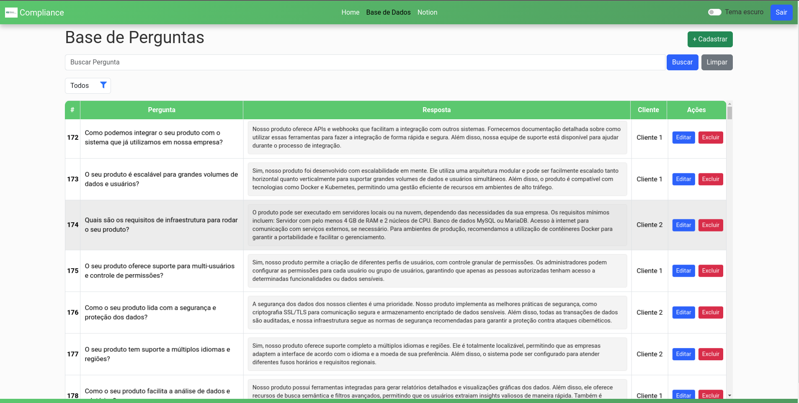
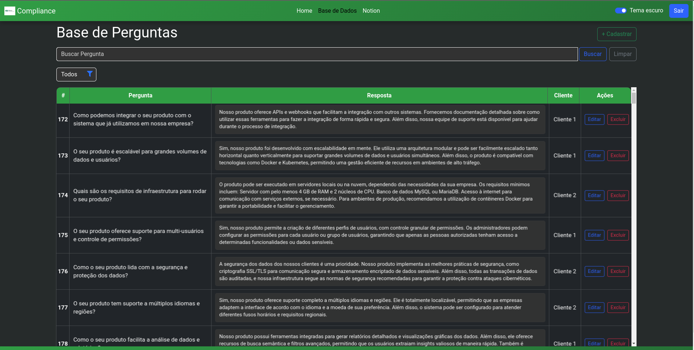

[PROJECT__BADGE]: https://img.shields.io/badge/📱Visit_this_project-000?style=for-the-badge&logo=project
[PROJECT__URL]: https://github.com/devjoaopedrojp/gestao_compliance

<h1 align="center" style="font-weight: bold;">Gestão Compliance 💻</h1>

<p align="center">
  
  
  
  
  
  <!--  -->
</p>

<p align="center">
 <a href="#sobre">Sobre</a> • 
 <a href="#setup">Setup</a> • 
 <a href="#started">Rotas da Aplicação</a> • 
 <a href="#colab">Colaboradores</a> •
 <a href="#contribuicao">Contribuição</a>
</p>

<h3 align="center">Interface Tema Claro</h3>
<p align="center">
    
</p>
<h3 align="center">Interface Tema Escuro</h3>
<p align="center">
    
</p>

<h2 id="started">📌 Sobre</h2>

Este projeto foi desenvolvido para otimizar os processos de um setor de Compliance, focando em melhorar a organização da equipe e a gestão das tarefas diárias. Ele oferece uma maneira eficiente de registrar e organizar perguntas e respostas de questionários técnicos, com um sistema de busca semântica avançada para facilitar a pesquisa.

### A aplicação é projetada para:
- Registrar perguntas realizadas em questionários técnicos solicitados ao setor.
- Armazenar e gerenciar as respostas de forma eficiente.
- Oferecer busca semântica avançada utilizando embeddings, permitindo localizar perguntas e respostas de forma mais inteligente e precisa. Em vez de depender exclusivamente das palavras-chave, a busca avalia o valor semântico e o contexto das consultas, retornando os resultados mais próximos em significado ao que foi pesquisado.
### Tecnologias Utilizadas
- _**Django:**_ Framework backend para o desenvolvimento da aplicação.
- _**Bootstrap:**_ Framework frontend para criar interfaces responsivas e atraentes.
- _**JavaScript:**_ Linguagem de programação para implementar funcionalidades interativas e dinâmicas na interface do usuário.
- _**MariaDB:**_ Banco de dados relacional para armazenamento de informações.
- _**Docker:**_ Para a containerização do projeto, garantindo fácil implantação e portabilidade.
<!-- - _**Notion:**_ Usado para organização de tarefas internas da equipe, com um painel de modelo Kanban para ajudar no controle de tarefas e progresso. -->

Essa solução foi projetada para oferecer maior praticidade na execução dos processos e na gestão das tarefas do time, promovendo maior eficiência e organização.

[![project][PROJECT__BADGE]][PROJECT__URL]

<h2 id="started">🚀 Setup</h2>

Este guia explica como configurar e executar o projeto localmente.

<h3>Pré-requisitos</h3>

Certifique-se de ter as seguintes ferramentas instaladas no seu ambiente:

- [Git](https://git-scm.com/)  
- [Docker](https://www.docker.com/)  
- [Docker Compose](https://docs.docker.com/compose/)  

>Observação: Caso esteja utilizando Docker, não é necessário instalar o MariaDB e o Python manualmente, pois o Docker cuidará disso. As ferramentas são gerenciadas pelos containers.

- [Python 3.10+](https://www.python.org/downloads/) (caso não for utilizar Docker)
- [MariaDB](https://mariadb.org/) (caso não for utilizar Docker)


<h3>Clonando o projeto</h3>

Clone o repositório do projeto no seu ambiente local:

```bash
git clone git@github.com:devjoaopedrojp/gestao_compliance_public.git
```

<h3>Executando o projeto</h3>

1. Acesse o diretório do projeto:

```bash
cd gestao_compliance
```

2. Configure o ambiente virtual e instale as dependências:

```bash
python -m venv venv  
source venv/bin/activate  # No Windows: venv\Scripts\activate  
pip install -r requirements.txt  
```

3. Configure corretamente as variáveis de ambiente (arquivo .env), conforme exemplo em arquivo (.env.example)
```bash
# Django settings
DJANGO_SECRET_KEY="your-django-secret-key-here"  # Substitua por uma chave secreta única e segura
# Para gerar uma chave secreta aleatória, você pode usar o seguinte comando no Python:
# import secrets
# print(secrets.token_urlsafe(50))

DJANGO_DEBUG=1  # Em produção, sempre use 0 ou False
DJANGO_ALLOWED_HOSTS="localhost"  # Adicione os hosts permitidos no seu ambiente

# MySQL/MariaDB Database settings
MYSQL_ROOT_PASSWORD="your-mysql-root-password-here"  # Substitua pela senha do root do MySQL/MariaDB
MYSQL_DATABASE="your-database-name-here"  # Substitua pelo nome do seu banco de dados
MYSQL_USER="your-mysql-username-here"  # Substitua pelo nome do seu usuário MySQL
MYSQL_PASSWORD="your-mysql-password-here"  # Substitua pela senha do seu usuário MySQL

# Database connection settings
DB_NAME="your-database-name-here"  # Substitua pelo nome do banco de dados
DB_USER="your-db-username-here"  # Substitua pelo nome de usuário do banco de dados
DB_PASSWORD="your-db-password-here"  # Substitua pela senha do banco de dados
DB_HOST="your-db-host-here"  # Substitua pelo host do banco de dados (normalmente 'db' se for Docker)
DB_PORT=3306  # Normalmente, a porta padrão do MySQL/MariaDB é 3306
```
><b>Importante</b>: Nunca compartilhe o arquivo .env com credenciais sensíveis. Crie uma cópia do arquivo .env.example, renomeando-o para .env, e preencha as variáveis com os valores do seu ambiente local.

4. Inicie os containers do Docker:

```bash
docker-compose up  # Caso necessário usar comando 'sudo'
```
>o Docker irá automaticamente configurar o banco de dados MariaDB, não é necessário configurar o banco manualmente (já que o Docker vai usar a configuração do .env para isso).

5. Após rodar o comando `docker-compose up`, acesse o container do Django:
```bash
docker exec -it <nome_do_container> bash
```
>Substitua <nome_do_container> pelo nome do seu container Django (sugestão - gestaocompliance_django_1).

6. Dentro do container, execute o comando para criar um superusuário:

```bash
python manage.py createsuperuser
```
>Você será solicitado a fornecer um nome de usuário, e-mail e senha para o superusuário.

7. Acesse a aplicação no navegador:

- O servidor estará disponível em http://localhost:8000.

- Você pode acessar o painel de administração do Django em: http://localhost:8000/admin

<!-- <h2>Notion</h2>

1. Acesse o Link abaixo e faça uma cópia do painel para o seu perfil, alterando o que for necessário.

link:

2. Adicione o Link do Notion na navbar para melhor acesso. -->

<h2 id="routes">📍 Rotas da Aplicação</h2>

Abaixo estão listadas as principais rotas da aplicação, juntamente com uma breve descrição de suas funcionalidades:
​
| rota               | descrição                                          
|----------------------|-----------------------------------------------------
| <kbd>/login</kbd>     | página de login
| <kbd>/todo_list</kbd>     | página inicial com base das perguntas e respostas
| <kbd>/create</kbd>     | página de cadastro de novos registros
| <kbd>/update</kbd>     | página de edição de registros

<h2 id="colab">🤝 Colaboradores</h2>

Agradecimento especial a todos que contribuíram para este projeto.

<table>
  <tr>
    <td align="center">
      <a href="#">
        <br>
        <sub>
          <b>João Pedro</b>
        </sub>
      </a>
    </td>
  </tr>
</table>

<h2 id="contribuicao">📫 Contribuição</h2>

Caso queira contribuir com o projeto siga as etapas recomendadas para colaboração:

1. Clone o repositório:
```bash
git clone https://github.com/devjoaopedrojp/gestao_compliance.git
```
2. Crie uma nova branch para implementar a funcionalidade ou corrigir um problema. Nomeie a branch de forma descritiva, para que seja fácil entender o propósito da alteração. Por exemplo, para uma nova funcionalidade, você pode usar:
```bash
git checkout -b feature/nova-funcionalidade
```
Para corrigir um erro, algo como:
```bash
git checkout -b fix/corrigir-erro
```
3. Antes de fazer o commit, verifique se você está seguindo o padrão de commits do projeto. Os commits devem ser claros e descritivos, de forma que expliquem o que foi alterado e por quê.

4. Abra um Pull Request (PR) explicando a funcionalidade desenvolvida ou o problema resolvido. Caso existam modificações visuais, inclua capturas de tela para facilitar a revisão.

<h3>Documentação adicional</h3>

Se necessário, consulte os seguintes links para ajuda sobre o processo de contribuição:

[📝 Como criar um Pull Request](https://www.atlassian.com/br/git/tutorials/making-a-pull-request)

[💾 Padrão de Commits](https://gist.github.com/joshbuchea/6f47e86d2510bce28f8e7f42ae84c716)


